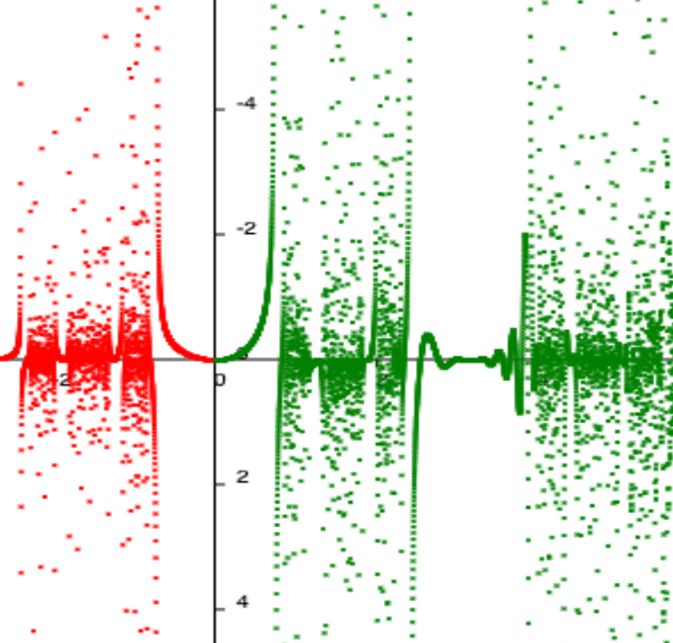
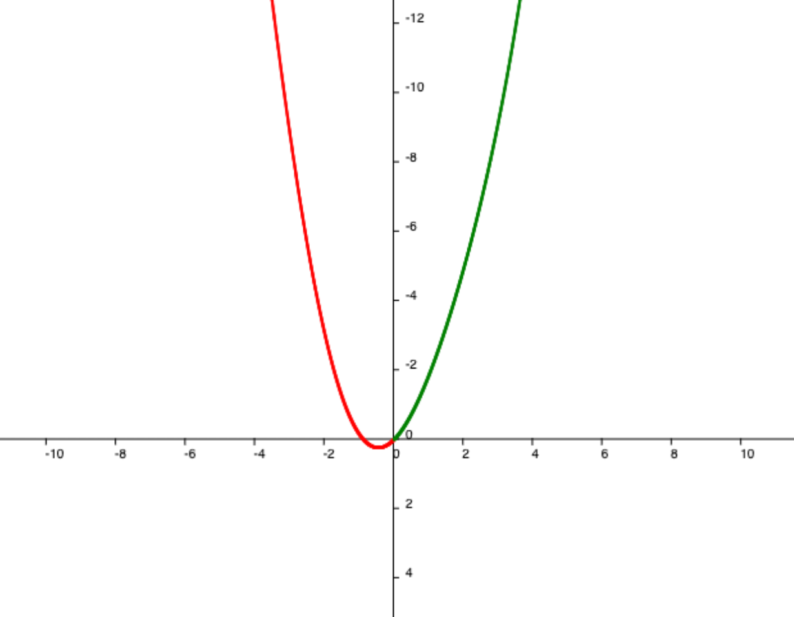
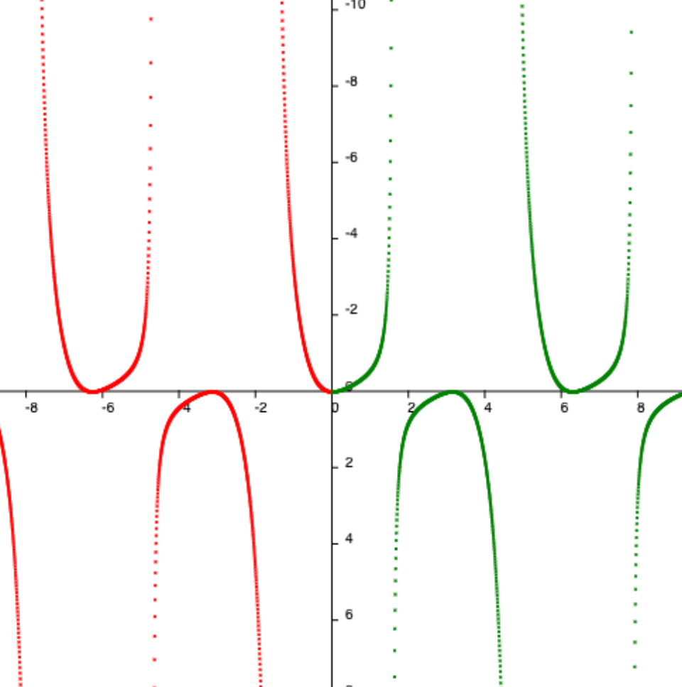
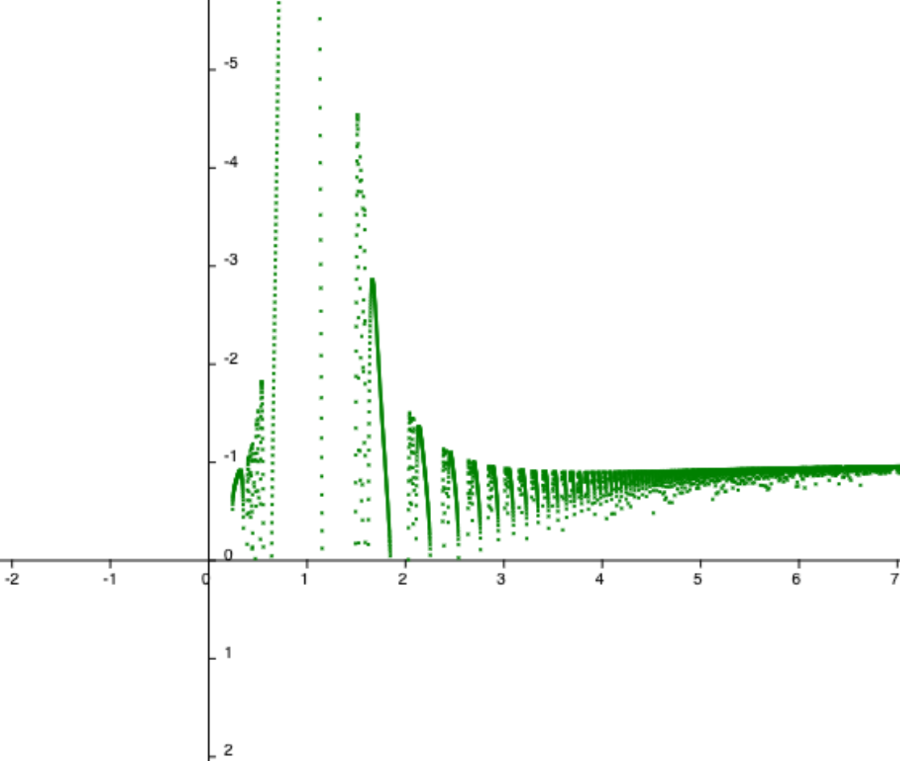
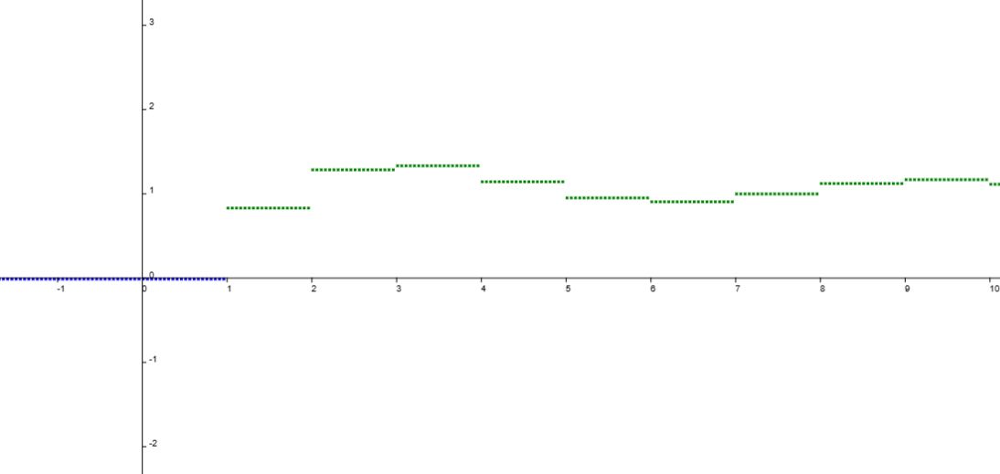

# EKwa - Traceur de courbe léger et portable



## Introduction

A l'instar de [Desmos](https://www.desmos.com/calculator?lang=fr) ou [Géogébra](https://www.geogebra.org/classic?lang=fr), EKwa est un simple traceur de fonction écrit en [Javascipt](https://developer.mozilla.org/fr/docs/Web/JavaScript), pouvant devenir un peu plus complexe en manipulant bien **JS**.

## Fonctionnalités

Il est possible de se balader dans le graphe généré par la fonction, choisir un intervalle, zoomer et choisir l'ecart (discrétisation entre chaque `x` de `f(x)`). La fonctionnalité la plus interessante est la saisie de fonction a l'aide des librairies natives de Javascript `(Math.*)`.

## Fonctionnement

Le fonctionnement est le plus basique qui soit, un canvas qui dessine un carré sur un pixel de la page a l'aide de chaque valeur de `f(x)`.
Une contrainte pour les Non-Javascriptien, les fonctions doivent obligatoirement etre ecrite en Javascript. Pourquoi ce choix ? Afin d'uniformiser toutes les façons d'écrire une fonction, pouvoir visualiser et surtout, visualiser l'équivalent d'un code Javascript (qui fait des boucles, etc...).
Un point important, les positions des points sont recalculer a chaque fois ce qui peut etre un peu embettant niveau performance.
L'application est écrite en Javascript natif donc pour l'inclure dans un projet React, veuillez effectuer toutes les transformations nécessaire.

## Application

L'application est disponible sous differente forme : sur le web (via gh-pages), en application pour un mode hors-ligne (via ElectronJS, désolé pour les 200mo) et en version auto-heberger web sur un navigateur.

## Evolutions

Ce projet peut evoluer en different point. Ameliorer l'intéraction avec l'application pour un Non-Javascriptien, rendre plus rapide l'application parce que la c'est un peu laborieux. Peut etre rajouter plus de design et rajouter plus de fonctionnalité tel que le téléchargement du graphes en plusieurs format, etc... Pour finir, vous pouvez rendre le projet "compatible" avec Node.js. En effet, une biblioteque interessante, [Math.js](https://mathjs.org/docs/), permet de se liberer du javascript lors de l'ecriture de la fonction. Il suffira juste de changer `scripts/utils.mjs` avec les implementations necéssaire.

## Contributions & Fork

Le projet est sans licence, faites en ce que vous voulez. Servez vous en tant que : template pour faire évoluer l'application, traceur de courbe personnalisé en modifiant le css, element de visualisation de fonction pour un exposer ou autre.

## Utilisations & Exemples

### Cas Triviales

Nous pouvons faire des simples courbes tel que :

$$
f(x) = sin(x)+x^2
$$

ou en javascript :

```js
(x) => Math.sin(x) + Math.pow(x, 2);
```



ou bien cette fonction :

$$
f(x)={cos(x)}(\frac{tan(x)^2}{e^{sin(x)}})
$$

ou en Javascript :

```js
Math.cos(x) * (Math.pow(Math.tan(x), 2) / Math.pow(Math.E, Math.sin(x)));
```



### Cas plus complexe

Dans l'introduction, je parlais d'une façon un peu plus complexe de construire des fonctions.
Dans le cas simple, nous sommes restreint qu'a une fonction. Cela est du au traitement interne de la transformation **string ↦ function** via `eval(string)`. En effet, l'application fait une concaténation :

```js
eval("(x) =>" + str);
// ou "str" est le retour d'une fonction sous forme de string. Ex : eval("(x) =>" + "Math.cos(x)") retournera cos(x).
```

On peut utiliser cette subtilité pour créer des sous-fonctions a n-parametres tel que :

$$
g(j, k)=(\frac{sin(tan(j))}{log(k)})^{k}
$$

$$
f(x)=g(e^{x},x^{log(\frac{x}{x^{2}})})
$$

soit :

$$
f(x)=(\frac{sin(tan(e^{x}))}{log(x^{log(\frac{x}{x^{2}})})})^{x^{log(\frac{x}{x^{2}})}}
$$

en mettant ceci dans le champ de saisie de `f(x)`:

```js
((j, k) => Math.pow(Math.sin(Math.tan(j)) / Math.log(k), k))(
    Math.pow(Math.E, x),
    Math.pow(x, Math.log(x / Math.pow(x, 2)))
);
```
soit la version extra-compressé de :

```js
const g = (j, k) => Math.pow(Math.sin(Math.tan(j)) / Math.log(k), k);
const f = (x) =>
    g(Math.pow(Math.E, x), Math.pow(x, Math.log(x / Math.pow(x, 2))));

// boucle en i=0, i+1, 0 -> inf
console.log(
    f(i) ===
        ((j, k) => Math.pow(Math.sin(Math.tan(j)) / Math.log(k), k))(
            Math.pow(Math.E, i),
            Math.pow(i, Math.log(i / Math.pow(i, 2)))
        )
); // donne true
```



C'est un peu long mais en gros,

$$
f(\lambda) = g(\psi(\lambda), \omega(\lambda))
$$

ou

$$
\psi(\lambda) \ et\ \omega(\lambda)
$$

sont des transformations quelconques de λ.

### Important a savoir

Comme dit plus haut, l'input texte est traduit via la fonction [eval](https://developer.mozilla.org/fr/docs/Web/JavaScript/Reference/Global_Objects/eval) de Javascript. Elle est ecrite simplement comme ceci :
```js
/**
 * Create function supportable by app
 * @param {string} str The function  in string
 * @returns {function} Function assiociate
 */
export const composeFunction = (str) => {
    try {
        return eval("(x)=>" + str);
    } catch (err) {
        return null;
    }
};
```
Cette facon de faire prive simplement le `x` des noms de variable possible d'utiliser dans l'expression javascript. Ce qui nous offre des possibilites d'operation tel que les sommes.

Voici un exemple avec la somme des sinus cardinal :

$$
\sum_{n=0}^{+\infin}{\frac{\sin(n)}{n}}
$$

traduit en Javascript:
```js
((f,n) => {
    let acc = 0; 
    for(let i = 0; i < n; ++i) acc += (f(i) || 0); 
    return acc;
})(
    (n) => Math.sin(n)/n,
    x
)
```



On reconnait ici le formattage de "Cas plus complexe" qui fonctionne exactement selon le meme principe. Sauf qu'ici, il n'est pas question de `()=>;` mais de `()=>{return;}`, soit une legerte variante qui permet d'ecrire du code dans le scope de la fonction anonyme. Si vous manipuler directement une autre fonction, veillez a prevoir le cas ou f(x) est non definit. Histoire de ne pas faire 0.335 + undefined et faire planter l'application :).

Gardez juste en tete que le retour de la fonction que vous allez ecrire dessinera un point au coordonnee `{x, y}` ou x correspond aux pas effectues et y le resultat de `f(x)`.